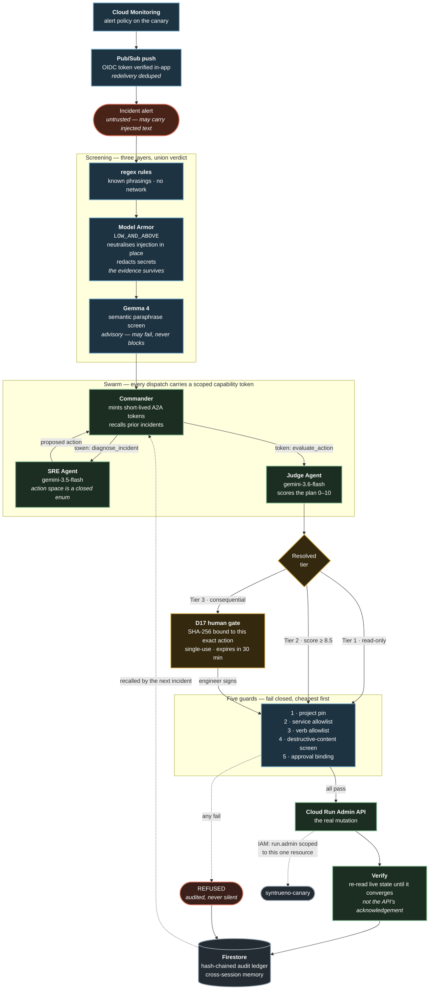

# Syntrueno

**Zero-trust autonomous cloud operations swarm on Google Cloud.**

Gemini-backed agents diagnose live incidents, propose remediations, judge their
own plans for safety, and — behind a cryptographic human gate — execute real
changes against real infrastructure, then verify the change actually took effect.

> Google Cloud "All Things Agentic" Hackathon 2026 · Track 3: The Fortified Enterprise Fleet

| | |
| :-- | :-- |
| **Live service** | https://syntrueno-18489510475.us-central1.run.app |
| **Agent card** | [`/.well-known/agent-card.json`](https://syntrueno-18489510475.us-central1.run.app/.well-known/agent-card.json) |
| **API docs** | [`/docs`](https://syntrueno-18489510475.us-central1.run.app/docs) |
| **Health** | [`/api/v1/health`](https://syntrueno-18489510475.us-central1.run.app/api/v1/health) |
| **Tests** | 209 passing offline in ~2s, no credentials required |

---

## See it work in 30 seconds

```bash
python scripts/run_demo.py --remote
```

Drives the live service and prints what actually came back. Add `--execute` to
sign the human gate and perform a real Cloud Run mutation.

Nothing in that output is scripted. Every latency and token count is measured by
the service, and when the swarm degrades or refuses, that is what prints.

---

## What it actually does

An incident arrives. What follows is real:



A measured run against the live service — `python scripts/run_demo.py --remote
--execute`, 2026-08-26:

```
injections neutralized  3
diagnosis               "the container for syntrueno-canary is experiencing Out
                         Of Memory terminations because its memory usage has
                         reached the 512Mi limit"
confidence              0.95
tool chosen             update_cloud_run_resources {memory: 1Gi, cpu: 1}
judge score             8.0 / 10  →  TIER_3_HUMAN_GATE
sre model               gemini-3.5-flash        2,175 ms
judge model             gemini-3.6-flash        7,426 ms
canary before           memory=512Mi
canary after            memory=1Gi     status APPLIED, verified True
signature replay        409 refused
ledger                  32 entries, chain valid
```

Dated because it is a live reading, not a fixture. Re-running it produces
different latencies, a different ledger height, and a differently worded
diagnosis — which is the point.

---

## Security design

The interesting decisions are the ones that make a class of failure
**unrepresentable** rather than merely blocked.

**The agent's action space is a closed enum.** `RemediationTool` is handed to
Gemini as its response schema. There is no destructive verb in it, so a
successful prompt injection cannot produce one — the worst it can achieve is a
*wrong safe action*, which the Judge and the human gate still have to pass.
Filtering a bad tool call is a weaker guarantee than making it unrepresentable.

**No delete verb exists.** `app/cloud/runadmin.py` implements only capacity and
lifecycle changes. Deletion is not blocked; it is absent. A blocked path can be
reached by a bug — an absent one cannot. A test asserts no delete API call
appears anywhere in the module.

**Evidence is not instruction.** Inbound telemetry and outbound tool calls get
different rule sets. Real alerts quote SQL and shell commands — that is what an
incident *looks like* — so screening evidence for `DROP TABLE` and refusing the
alert breaks the product's primary use case. Destructive-verb screening happens
at the tool-invocation boundary, the only place such a verb could do harm.

**Three screening layers, because none of them is enough alone.** The regex
rules catch the injection phrasings they were written for and nothing else.
Model Armor catches paraphrases no regex can enumerate. Gemma catches the
paraphrases Model Armor still misses. Measured 2026-08-25 over 8 paraphrased
injections matching none of the patterns, and 10 benign SRE alerts:

| Layer | Novel injections caught | False positives | Known attacks |
| :-- | --: | --: | --: |
| regex only | 0 / 8 | 0 / 10 | 5 / 5 |
| Model Armor `HIGH` | 0 / 8 | 0 / 10 | 4 / 5 |
| Model Armor `LOW_AND_ABOVE` | 4 / 8 | 1 / 10 | 5 / 5 |
| Gemma `gemma-4-26b-a4b-it` | 8 / 8 | 0 / 8 resolved | — |
| **union of all three** | **8 / 8** | **1 / 10** | **5 / 5** |

Model Armor runs at `LOW_AND_ABOVE`: that recall is the entire reason to make a
network call, and the one false positive is affordable *here specifically*
because telemetry takes the neutralise path, which defangs and proceeds rather
than refusing — a false positive costs a flag on a real incident, not a dropped
one. Raising the confidence to remove the flag also removes the recall that
justified the call.

Gemma closes the whole measured gap, and it is by some distance the least
reliable thing in this system. In the same run, 2 of 10 calls failed outright
even with five attempts and backoff, and 2 of the 8 that resolved returned a
JSON object with prose appended after it. So it is advisory: it cannot block an
incident, its failures cannot become incident failures, and a scan it missed
reports `degraded_reason` rather than reading as clean. `screened_by` names only
the layers that actually returned a verdict.

**The HTTP surface is unauthenticated, and that is a demo decision.** The
service runs `--allow-unauthenticated` and no route carries an auth dependency,
because judging is unattended: a judge opens the console and signs the gate
without an account existing to sign in to. The one exception is
`/api/v1/ingest/pubsub`, which verifies a Google-issued OIDC token against a
named service account and refuses when that expectation is unset — it is the
only path that reaches the swarm with no human at all, so it is the only one
that cannot afford to be open.

Naming the consequence rather than leaving it implied: anyone who can reach the
URL can raise an incident, sign its approval, and execute the result. What
stops that from being interesting is that the signature buys so little. The
mutation is allowlisted to `syntrueno-canary` alone, the verb must be one of a
handful of capacity changes, no destructive verb exists to reach for, the
signature is bound by SHA-256 to one exact parameter set, it is single-use, and
it dies after 30 minutes. The blast radius of the entire open surface is the
memory limit of a service that exists to have its memory limit changed.

For a real deployment the gate belongs behind Cloud Run IAM with the console
authenticating through IAP, and the approval record should carry the caller's
verified identity instead of a self-declared `engineer_id`. That is a
deployment posture change, not a code change, which is why the code does not
pretend to make it.

It runs concurrently with Model Armor behind a wait bound rather than a
transport deadline — the AI Studio API refuses any client deadline under 10
seconds, and 10 seconds of an 8-second incident spent on an advisory layer is
not a trade worth making. On expiry the call is abandoned and the scan says so.
Because it overlaps Model Armor rather than following it, incidents measure
6.0–7.8s with all three layers running, against 9.2s with two.

**Signatures authorise one execution.** A signed approval is bound by SHA-256 to
one tool, one parameter set, one tier. It is spent on execution and expires
after 30 minutes. It cannot be replayed, and it cannot cover a different action.

**IAM enforces the allowlist independently.** The runtime service account holds
`run.admin` on the canary service *resource*, never project-wide. The code check
and the platform check would both have to fail.

Its other grants are custom roles holding one capability each: predict against
Gemini, sanitize against one Model Armor template, and a read-only role the
FinOps agent uses to list services and read their metrics. That last one is
project-wide, and deliberately so — an auditor that can only see the service it
is allowed to change cannot tell you what the rest of the project is wasting,
and the previous version's answer to not being able to see was to make findings
up. Reading a service and being able to alter it remain separate.

**The system reports its own degradation.** Every fallback sets a visible flag.
Gemini unreachable → heuristic path plus `degraded: true` and a reason. Firestore
unreachable → in-memory plus a flag. A mutation that fails is audited as
`FAILED`, never as a silent success. Latencies come from `perf_counter` and token
counts from the model's own `usage_metadata`.

---

## Model routing

Gemini is served by **Vertex AI**. The two backends are not interchangeable,
and the difference is not only quota — verified by execution on 2026-08-25:

| | AI Studio (API key) | Vertex AI (ADC) |
| :-- | :-- | :-- |
| `gemini-3.x` | served | served, but **only from `location="global"`** |
| `gemini-2.5-*` | 404 for new keys | served |
| `gemini-2.5-pro` | 429 on free tier | reachable |
| Thinking-Flash cap | **20 requests/day, per model** | no daily cap |

The location detail is the sharp edge. In `us-central1` every `gemini-3.x` model
returns `404 NOT_FOUND`; they resolve from `global`. `VERTEX_LOCATION` is
therefore deliberately separate from `GOOGLE_CLOUD_LOCATION`, and a test asserts
they differ — collapsing the two looks like a tidy-up and silently breaks the
entire model chain.

| Tier | Model | Median on Vertex | Used for |
| :-- | :-- | --: | :-- |
| Fast | `gemini-3.5-flash` | ~1.6 s | diagnosis, extraction, triage |
| Reasoning | `gemini-3.6-flash` | ~5–8 s | safety judgement |

Every model in both chains is Gemini 3.5 or newer, and a test asserts it. The
fast tier ran on `gemini-3.1-flash-lite` until 2026-08-25 — measurably quicker
at ~1.25 s, and below the floor the eligibility gate checks. 300 ms is a cheap
price for removing that question.

Thinking is disabled on the fast tier, which does extraction rather than
judgement. That used to be applied by matching `lite` in the model name, on the
basis that full Flash models reject a zero budget — true on AI Studio, false on
Vertex, and a rule that silently re-enabled thinking the moment the fast tier
moved off a lite model. Measured over 5 calls each: `gemini-3.5-flash` honours
the zero budget and spends 0 thought tokens; `gemini-3.7-flash` accepts the
setting and ignores it, spending 81 anyway. It stays in the chain as a slower
but correct fallback.

Every `LlmResult` now carries which backend served it, because a 429 means
different things on each: on AI Studio it is usually a daily cap that no amount
of backoff will clear, on Vertex it is genuine rate pressure. The fallback chain
is retained for the second case.

Diagnosis runs on the fast tier deliberately: it is closer to extraction than to
judgement, and reserving the thinking budget for the Judge is where being wrong
actually costs something.

---

## Google Cloud stack

| Service | Use |
| :-- | :-- |
| **Cloud Run** | Hosts the API and the built frontend in one container |
| **Cloud Run Admin API** | The guarded remediation surface |
| **Vertex AI** | Serves both Gemini tiers via `google-genai`, from the `global` location |
| **Gemma** | `gemma-4-26b-a4b-it` via AI Studio — semantic injection screening |
| **Model Armor** | Screens inbound telemetry for injection ahead of the regex layer |
| **Cloud Monitoring** | Alert policy on canary memory pressure; measured utilisation for FinOps |
| **Cloud Billing Catalog** | Published Cloud Run rates, so cost findings are priced not guessed |
| **Pub/Sub** | Delivers that alert to the swarm over an OIDC-authenticated push |
| **Agent Registry** | All four agents published as A2A v1.0 cards, for cross-department discovery |
| **Vertex AI Memory Bank** | Semantic recall of prior incidents, with Firestore as the fallback |
| **Firestore** | Hash-chained audit ledger, cross-session memory, approvals, trajectories |
| **Secret Manager** | Gemini key and A2A signing secret, mounted at runtime |
| **IAM** | Resource-scoped `run.admin`, plus three single-permission custom roles |

---

## Run it locally

```bash
# 1. Configure
cp backend/.env.example backend/.env
#    add a free Gemini key from https://aistudio.google.com/apikey
#    generate a secret:  python -c "import secrets; print(secrets.token_urlsafe(48))"

# 2. Start both services
./dev.sh          # Linux / macOS
.\dev.bat         # Windows
```

- Frontend — http://localhost:5173
- API docs — http://localhost:8000/docs
- Agent card — http://localhost:8000/.well-known/agent-card.json

### Tests

```bash
cd backend && .venv/Scripts/pytest -q
```

**201 tests, ~1.9s, no API key and no cloud credentials needed.** The suite is
offline by construction: `conftest.py` forces every external dependency off
regardless of your local `.env`, and a guard test fails if writes ever get slow
enough to imply a network round trip.

### Deploy

```bash
./deploy.sh
```

Builds from the repo root so the frontend ships with the API, mounts secrets
from Secret Manager, and sets a 300s request timeout — real reasoning takes
longer than the 60s default allows.

---

## Repository layout

```
backend/app/
  llm/gemini.py          sole Gemini entry point — routing, chain fallback, telemetry
  agents/                sre · judge · finops · commander
  cloud/runadmin.py      the only code that can change infrastructure
  security/              model_armor · token_auth · human_gate
  ingest/monitoring.py   Cloud Monitoring → Pub/Sub push, OIDC-verified
  storage/               firestore_backend · audit_ledger · memory_bank
  compiler/              ThorForja trajectory recording and compilation
backend/tests/           201 offline tests
frontend/src/            React 19 + TypeScript operations console
assets/architecture.*    the diagram above, as PNG and SVG
scripts/run_demo.py      end-to-end demo against a live deployment
```

Only `app/cloud/*` talks to Google Cloud, and only `app/llm/*` talks to Gemini.
Agents depend on those interfaces, which is what keeps every agent testable with
no network.

---

## Status

Built and verified live:

- [x] Gemini-backed diagnosis and safety judgement, with honest degradation
- [x] Firestore persistence — ledger head recovery verified across a cold start
- [x] Guarded Cloud Run remediation with post-change verification
- [x] Single-use, hash-bound, expiring approvals
- [x] Enforced A2A capability tokens on every agent dispatch
- [x] Secrets in Secret Manager, resource-scoped IAM

- [x] `modelarmor.googleapis.com` screening in front of the regex layer
- [x] Cloud Monitoring alert → Pub/Sub → webhook, for fully event-driven triage
- [x] Gemini served by Vertex AI, off the free tier's per-model daily cap
- [x] Streamed incident progress in the console — real stages, no staged timing
- [x] ThorForja mining recurring trajectories into deterministic proposals

- [x] FinOps auditing real limits against measured usage, priced from Google's catalog
- [x] Gemma as a third screening layer, closing the gap the other two leave

- [x] All four agents published into **Agent Registry**, carrying the same A2A
      v1.0 cards this service serves — `python scripts/register_agents.py`
- [x] **Vertex AI Memory Bank** recalling prior incidents by meaning rather than
      by service-name substring, with Firestore behind it

Recall names the store that answered, in `past_memory_source` on every incident
result. The two are not interchangeable — one matches on meaning, the other on
substring — so a silent fallback would look identical to a working recall from
the outside. Measured live 2026-08-26: "the container keeps dying and coming
back under load" recalled an OOMKill fact at distance 0.888, sharing almost no
words with it.

Worth recording alongside that, because this project's habit is to say what was
wrong rather than only what is right: the Agent Card served at the reserved
well-known path was v0.3-shaped while declaring `protocolVersion: "1.0"` until
2026-08-26. Nothing in this repository caught it. Google's Agent Registry did,
by refusing to store it — four rejections, one per field. A discovery document
is exactly the artefact whose errors nothing local will notice, because the
only thing that reads it strictly is somebody else's client.

In progress:

- [ ] Multimodal telemetry ingestion
- [ ] A BigQuery billing export, so FinOps can reconcile against billed spend
      rather than computing from published rates

Known constraint: the deployment is pinned to `--max-instances 1`. The ledger
chains each entry to the previous through process-local state, so a second
container would fork the chain. The in-process race is closed by a lock;
removing the single-instance limit needs the chain head moved into a Firestore
transaction first.

## FinOps

The agent compares what each Cloud Run service is *configured* to hold against
what Cloud Monitoring recorded it actually using, and prices the gap at the rate
the Cloud Billing Catalog publishes for the region. A reading taken
2026-08-26:

```
cloud-run/syntrueno         1024Mi configured, peaked at 167Mi across 3,464 samples
                            recommend 267Mi, recover 757Mi        $4.79/month
cloud-run/syntrueno-canary   512Mi configured, peaked at  21Mi across   110 samples
                            recommend 256Mi, recover 256Mi        scale-to-zero, unpriced
```

The window is a rolling seven days, so every figure here moves on its own —
sample counts climb, the peak drifts, the price follows the catalog. Read the
shape, not the digits; `/api/v1/swarm/finops/audit` is the current answer.

$4.86 is a small number. It is also a true one, which the $440 this module used
to report was not — it returned three invented resources that did not exist in
the project, from a docstring claiming it queried BigQuery billing records.

Three rules make the figures worth reading:

**A finding needs an observation.** A service Monitoring has no data for is
reported as unmeasured, not as idle. Sizing a limit down because nothing was
observed would be the most confident recommendation this agent could make and
the least justified.

**Headroom is not waste.** The recommendation is the measured peak plus 60%,
floored at 256Mi — never the peak itself. This system exists because a service
died at 512Mi. An agent that trims to the high-water mark reintroduces exactly
that incident, and reports a saving for it.

**No price, no number.** When the catalog is unreachable, findings still list
what is over-provisioned, without dollars. A scale-to-zero service is billed per
request, so no monthly figure is claimed for one at all: a number derived from
always-on seconds would overstate it by however much of the month it was idle.

There is no BigQuery billing export on this project, and the audit says so
rather than implying its figures came from billed spend.

The largest saving here is on `syntrueno` itself, which the remediation
allowlist forbids mutating — so acting on that proposal is refused, by name,
and audited:

```
Service 'syntrueno' is not on the remediation allowlist.
Only 'syntrueno-canary' may be mutated.
```

That is the intended shape rather than an awkward edge. The auditor can see the
whole project; it can change one service. Teaching the auditor to only report
findings it is permitted to act on would hide real waste, and duplicating the
allowlist into a second module is how the two copies start to disagree.

---

## ThorForja

After the same tool sequence has resolved the same class of incident several
times, asking a model to derive it again is the part that stopped being useful.
ThorForja mines those sequences into deterministic skills.

**A compiled skill replaces the diagnosis, never the authorisation.** Skipping
the SRE call is the saving. Skipping the Judge would make the compiler a route
around every guard in this document — one that anybody able to make a sequence
recur could open. So a compiled skill returns a *proposal*, and that proposal is
judged, tiered and gated exactly as a model-derived one is. One diagnosis call
is the only saving claimed.

**Recurrence is counted in incidents, not rows.** Counting rows would let a
Pub/Sub redelivery, or a replayed demo, look identical to a pattern. Two
recordings of one incident compile to nothing.

The numbers on a manifest are measured or absent. `verified_by_judge` is true
only when the Judge approved every trajectory in the cluster, and an unjudged
trajectory counts as unapproved rather than defaulting to safe. `tokens_saved`
is the mean of the diagnosis calls the skill actually replaces, which is `0`
when the swarm ran offline and spent nothing — zero being the honest answer when
nothing was measured. Dispatch latency comes from `perf_counter`.

Missing inputs are refused rather than filled in. A skill mined against the
canary with a guessed `service_id` is a skill pointed somewhere else.

---

## License

Apache-2.0. See [LICENSE](LICENSE).
