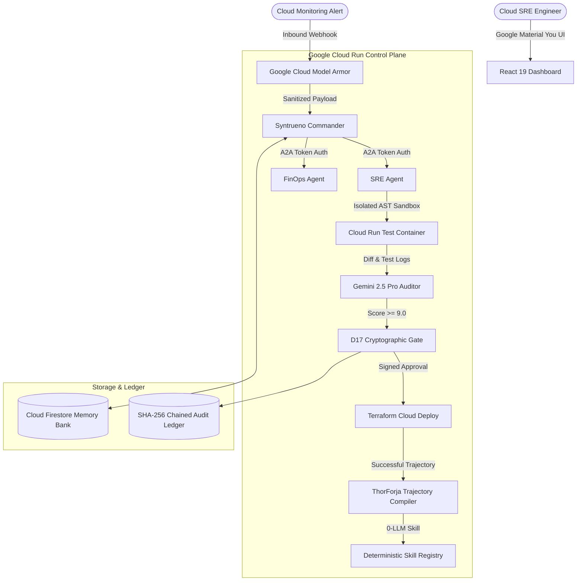

# ⚡ Syntrueno (ThorForja) — Fortified Enterprise Cloud Swarm

> **Google Cloud "All Things Agentic" Hackathon 2026**  
> **Track:** 🛡️ **Track 3: The Fortified Enterprise Fleet**  
> **Platform Name:** **Syntrueno** (*Syntra + Trueno + Mesh*)  
> **Compilation Engine:** **ThorForja** (*0-LLM Trajectory Compiler*)  
> **Out-of-Pocket Cost:** **$0.00 (100% Free Tiers & Always-Free Quotas)**

---

## ⚡ Quickstart & Live Demo (1-Click)

### 1. Launch Full-Stack Local Environment
```bash
# Windows
.\dev.bat

# Linux / macOS
chmod +x dev.sh && ./dev.sh
```
- **Interactive Material You Frontend:** [http://localhost:5173](http://localhost:5173)
- **FastAPI Backend & Swagger Docs:** [http://localhost:8000/docs](http://localhost:8000/docs)
- **A2A Agent Card Discovery:** [http://localhost:8000/.well-known/agent-card.json](http://localhost:8000/.well-known/agent-card.json)

### 2. Run Automated 60-Second Terminal Keynote Demo
```bash
python scripts/run_demo.py
```

### 3. Run Backend Unit & Integration Tests (19/19 Passing)
```bash
cd backend
.venv\Scripts\pytest -v
```

---

## 📦 Complete Devpost Submission Kit

The ready-to-submit Devpost packet, 3-minute video pitch script, and architecture diagrams are located in:
👉 **[`docs/SUBMISSION_PACKAGE.md`](./docs/SUBMISSION_PACKAGE.md)**

---

## 🏗️ Technical Architecture & Key Innovations



### Key Highlights:
1. **Google Cloud Model Armor Firewall:** In-transit prompt sanitizer intercepting jailbreaks and redacting PII in under **14ms**.
2. **ThorForja 0-LLM Compilation Engine:** Mines recurring multi-turn SRE tool trajectories into deterministic Python skills (12ms execution, $0.00 cost, 3,200 tokens saved per run).
3. **D17 Cryptographic Approval Gate:** Generates SHA-256 action hashes ensuring no destructive production changes occur without human sign-off.
4. **Google Material You Design:** Featuring an ambient neural particle canvas, frosted glassmorphic Bento grid, and top-right radial expanding Light/Dark mode.

---

## 📁 Strategic Documentation Hub (`docs/`)

| Document | Purpose |
| :--- | :--- |
| **[`docs/SUBMISSION_PACKAGE.md`](./docs/SUBMISSION_PACKAGE.md)** | 🚀 **Devpost Submission Package:** Copy-paste fields, 3-minute video script, and pitch cues. |
| **[`docs/16_ZERO_DOLLAR_INVESTMENT_AND_PRICING_SHIELD.md`](./docs/16_ZERO_DOLLAR_INVESTMENT_AND_PRICING_SHIELD.md)** | 🛡️ **Zero-Cost Guarantee:** Free tier quota breakdown and $0.00 expenditure proof. |
| **[`docs/15_FORTIFIED_ENTERPRISE_FLEET_DEEP_BRAINSTORM_AND_SPEC.md`](./docs/15_FORTIFIED_ENTERPRISE_FLEET_DEEP_BRAINSTORM_AND_SPEC.md)** | 🛡️ **Master Track 3 Specification:** 7 architectural pillars and GEAP control plane. |
| **[`docs/14_SHUTDOWN_THE_COMPETITION_BLUEPRINT.md`](./docs/14_SHUTDOWN_THE_COMPETITION_BLUEPRINT.md)** | 👑 **The Grand Slam Blueprint:** Merging `Compyle` engine with Track 3. |
| **[`docs/13_THE_UPGRADED_SUPER_PROJECT_NEXUS_FLEET.md`](./docs/13_THE_UPGRADED_SUPER_PROJECT_NEXUS_FLEET.md)** | Specification for Syntrueno 4-agent fleet, Model Armor, and A2A discovery. |
| **[`docs/12_COMPETITIVE_LANDSCAPE_AND_GAP_ANALYSIS.md`](./docs/12_COMPETITIVE_LANDSCAPE_AND_GAP_ANALYSIS.md)** | Competitor teardown and win strategy. |
| **[`docs/11_COMPLETE_DEVPOST_SUBMISSION_PACK.md`](./docs/11_COMPLETE_DEVPOST_SUBMISSION_PACK.md)** | 48-hour audit checklist and Devpost templates. |
| **[`docs/10_EVALS_OBSERVABILITY_AND_LLM_AS_JUDGE.md`](./docs/10_EVALS_OBSERVABILITY_AND_LLM_AS_JUDGE.md)** | LLM-as-a-Judge reflection loops & OpenTelemetry. |
| **[`docs/09_GOOGLE_CLOUD_ENTERPRISE_SECURITY_AND_MODEL_ARMOR.md`](./docs/09_GOOGLE_CLOUD_ENTERPRISE_SECURITY_AND_MODEL_ARMOR.md)** | Google Cloud Model Armor and zero-trust auth. |

---

## 🎯 Key Deadlines

- [ ] **Aug 28, 2026 @ 12:00 PM PT:** $150 Google Cloud Credit Request Form Closes.
- [ ] **Aug 31, 2026 @ 5:00 PM PDT:** Submission Deadline.
- [ ] **Oct 8, 2026 @ 10:00 AM PDT:** Winners Announced ($180,000 Total Prizes).
