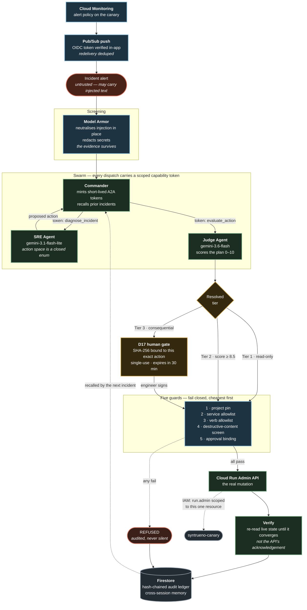

# Syntrueno

**Zero-trust autonomous cloud operations swarm on Google Cloud.**

Gemini-backed agents diagnose live incidents, propose remediations, judge their
own plans for safety, and — behind a cryptographic human gate — execute real
changes against real infrastructure, then verify the change actually took effect.

> Google Cloud "All Things Agentic" Hackathon 2026 · Track 3: The Fortified Enterprise Fleet

| | |
| :-- | :-- |
| **Live service** | https://syntrueno-18489510475.us-central1.run.app |
| **Agent card** | [`/.well-known/agent-card.json`](https://syntrueno-18489510475.us-central1.run.app/.well-known/agent-card.json) |
| **API docs** | [`/docs`](https://syntrueno-18489510475.us-central1.run.app/docs) |
| **Health** | [`/api/v1/health`](https://syntrueno-18489510475.us-central1.run.app/api/v1/health) |
| **Tests** | 154 passing offline in ~1.4s, no credentials required |

---

## See it work in 30 seconds

```bash
python scripts/run_demo.py --remote
```

Drives the live service and prints what actually came back. Add `--execute` to
sign the human gate and perform a real Cloud Run mutation.

Nothing in that output is scripted. Every latency and token count is measured by
the service, and when the swarm degrades or refuses, that is what prints.

---

## What it actually does

An incident arrives. What follows is real:



A measured run against the live service:

```
injections neutralized  1
diagnosis               "memory usage is consistently hitting the 512Mi limit,
                         causing repeated OOMKilled and 7 restarts"
confidence              1.0
tool chosen             update_cloud_run_resources {memory: 1Gi, cpu: 1}
judge score             8.0 / 10  →  TIER_3_HUMAN_GATE
sre model               gemini-3.1-flash-lite   1,178 ms
judge model             gemini-3.6-flash        5,596 ms
canary before           memory=512Mi
canary after            memory=1Gi     status APPLIED, verified True
signature replay        409 refused
ledger                  12 entries, chain valid
```

---

## Security design

The interesting decisions are the ones that make a class of failure
**unrepresentable** rather than merely blocked.

**The agent's action space is a closed enum.** `RemediationTool` is handed to
Gemini as its response schema. There is no destructive verb in it, so a
successful prompt injection cannot produce one — the worst it can achieve is a
*wrong safe action*, which the Judge and the human gate still have to pass.
Filtering a bad tool call is a weaker guarantee than making it unrepresentable.

**No delete verb exists.** `app/cloud/runadmin.py` implements only capacity and
lifecycle changes. Deletion is not blocked; it is absent. A blocked path can be
reached by a bug — an absent one cannot. A test asserts no delete API call
appears anywhere in the module.

**Evidence is not instruction.** Inbound telemetry and outbound tool calls get
different rule sets. Real alerts quote SQL and shell commands — that is what an
incident *looks like* — so screening evidence for `DROP TABLE` and refusing the
alert breaks the product's primary use case. Destructive-verb screening happens
at the tool-invocation boundary, the only place such a verb could do harm.

**Two screening layers, because neither is enough.** The regex rules catch the
injection phrasings they were written for and nothing else. Model Armor catches
paraphrases no regex can enumerate. Measured 2026-08-25 over 8 paraphrased
injections matching none of the patterns, and 10 benign SRE alerts:

| Layer | Novel injections caught | False positives | Known attacks |
| :-- | --: | --: | --: |
| regex only | 0 / 8 | 0 / 10 | 5 / 5 |
| Model Armor `HIGH` | 0 / 8 | 0 / 10 | 4 / 5 |
| Model Armor `LOW_AND_ABOVE` | 4 / 8 | 1 / 10 | 5 / 5 |
| **union of both** | **4 / 8** | **1 / 10** | **5 / 5** |

The template runs at `LOW_AND_ABOVE`. That recall is the entire reason to make a
network call, and the one false positive is affordable *here specifically*
because telemetry takes the neutralise path, which defangs and proceeds rather
than refusing — a false positive costs a flag on a real incident, not a dropped
one. Raising the confidence to remove the flag also removes the recall that
justified the call. When Model Armor is unreachable the regex verdict still
stands and the scan reports `degraded_reason` rather than implying it was clean.

**Signatures authorise one execution.** A signed approval is bound by SHA-256 to
one tool, one parameter set, one tier. It is spent on execution and expires
after 30 minutes. It cannot be replayed, and it cannot cover a different action.

**IAM enforces the allowlist independently.** The runtime service account holds
`run.admin` on the canary service *resource*, never project-wide. The code check
and the platform check would both have to fail.

**The system reports its own degradation.** Every fallback sets a visible flag.
Gemini unreachable → heuristic path plus `degraded: true` and a reason. Firestore
unreachable → in-memory plus a flag. A mutation that fails is audited as
`FAILED`, never as a silent success. Latencies come from `perf_counter` and token
counts from the model's own `usage_metadata`.

---

## Model routing

Gemini is served by **Vertex AI**. The two backends are not interchangeable,
and the difference is not only quota — verified by execution on 2026-08-25:

| | AI Studio (API key) | Vertex AI (ADC) |
| :-- | :-- | :-- |
| `gemini-3.x` | served | served, but **only from `location="global"`** |
| `gemini-2.5-*` | 404 for new keys | served |
| `gemini-2.5-pro` | 429 on free tier | reachable |
| Thinking-Flash cap | **20 requests/day, per model** | no daily cap |

The location detail is the sharp edge. In `us-central1` every `gemini-3.x` model
returns `404 NOT_FOUND`; they resolve from `global`. `VERTEX_LOCATION` is
therefore deliberately separate from `GOOGLE_CLOUD_LOCATION`, and a test asserts
they differ — collapsing the two looks like a tidy-up and silently breaks the
entire model chain.

| Tier | Model | Measured on Vertex | Used for |
| :-- | :-- | --: | :-- |
| Fast | `gemini-3.1-flash-lite` | ~1.4–3.9 s | diagnosis, extraction, triage |
| Reasoning | `gemini-3.6-flash` | ~2.8–10.0 s | safety judgement |

Every `LlmResult` now carries which backend served it, because a 429 means
different things on each: on AI Studio it is usually a daily cap that no amount
of backoff will clear, on Vertex it is genuine rate pressure. The fallback chain
is retained for the second case.

Diagnosis runs on the fast tier deliberately: it is closer to extraction than to
judgement, and reserving the thinking budget for the Judge is where being wrong
actually costs something.

---

## Google Cloud stack

| Service | Use |
| :-- | :-- |
| **Cloud Run** | Hosts the API and the built frontend in one container |
| **Cloud Run Admin API** | The guarded remediation surface |
| **Vertex AI** | Serves both Gemini tiers via `google-genai`, from the `global` location |
| **Model Armor** | Screens inbound telemetry for injection ahead of the regex layer |
| **Cloud Monitoring** | Alert policy on canary memory pressure, the event source |
| **Pub/Sub** | Delivers that alert to the swarm over an OIDC-authenticated push |
| **Firestore** | Hash-chained audit ledger, cross-session memory, approvals, trajectories |
| **Secret Manager** | Gemini key and A2A signing secret, mounted at runtime |
| **IAM** | Resource-scoped `run.admin`, plus two single-permission custom roles |

---

## Run it locally

```bash
# 1. Configure
cp backend/.env.example backend/.env
#    add a free Gemini key from https://aistudio.google.com/apikey
#    generate a secret:  python -c "import secrets; print(secrets.token_urlsafe(48))"

# 2. Start both services
./dev.sh          # Linux / macOS
.\dev.bat         # Windows
```

- Frontend — http://localhost:5173
- API docs — http://localhost:8000/docs
- Agent card — http://localhost:8000/.well-known/agent-card.json

### Tests

```bash
cd backend && .venv/Scripts/pytest -q
```

**154 tests, ~1.4s, no API key and no cloud credentials needed.** The suite is
offline by construction: `conftest.py` forces every external dependency off
regardless of your local `.env`, and a guard test fails if writes ever get slow
enough to imply a network round trip.

### Deploy

```bash
./deploy.sh
```

Builds from the repo root so the frontend ships with the API, mounts secrets
from Secret Manager, and sets a 300s request timeout — real reasoning takes
longer than the 60s default allows.

---

## Repository layout

```
backend/app/
  llm/gemini.py          sole Gemini entry point — routing, chain fallback, telemetry
  agents/                sre · judge · finops · commander
  cloud/runadmin.py      the only code that can change infrastructure
  security/              model_armor · token_auth · human_gate
  ingest/monitoring.py   Cloud Monitoring → Pub/Sub push, OIDC-verified
  storage/               firestore_backend · audit_ledger · memory_bank
  compiler/              ThorForja trajectory recording and compilation
backend/tests/           154 offline tests
frontend/src/            React 19 + TypeScript operations console
docs/specs/              system design
scripts/run_demo.py      end-to-end demo against a live deployment
```

Only `app/cloud/*` talks to Google Cloud, and only `app/llm/*` talks to Gemini.
Agents depend on those interfaces, which is what keeps every agent testable with
no network.

---

## Status

Built and verified live:

- [x] Gemini-backed diagnosis and safety judgement, with honest degradation
- [x] Firestore persistence — ledger head recovery verified across a cold start
- [x] Guarded Cloud Run remediation with post-change verification
- [x] Single-use, hash-bound, expiring approvals
- [x] Enforced A2A capability tokens on every agent dispatch
- [x] Secrets in Secret Manager, resource-scoped IAM

- [x] `modelarmor.googleapis.com` screening in front of the regex layer
- [x] Cloud Monitoring alert → Pub/Sub → webhook, for fully event-driven triage
- [x] Gemini served by Vertex AI, off the free tier's per-model daily cap
- [x] Streamed incident progress in the console — real stages, no staged timing
- [x] ThorForja mining recurring trajectories into deterministic proposals

In progress:

- [ ] Multimodal telemetry ingestion and BigQuery-backed FinOps

Known constraint: the deployment is pinned to `--max-instances 1`. The ledger
chains each entry to the previous through process-local state, so a second
container would fork the chain. The in-process race is closed by a lock;
removing the single-instance limit needs the chain head moved into a Firestore
transaction first.

`docs/` also contains the strategy research this project was planned from. Those
documents predate the build and describe intent rather than current state; where
they disagree with this README, this README is what the code does.

---

## ThorForja

After the same tool sequence has resolved the same class of incident several
times, asking a model to derive it again is the part that stopped being useful.
ThorForja mines those sequences into deterministic skills.

**A compiled skill replaces the diagnosis, never the authorisation.** Skipping
the SRE call is the saving. Skipping the Judge would make the compiler a route
around every guard in this document — one that anybody able to make a sequence
recur could open. So a compiled skill returns a *proposal*, and that proposal is
judged, tiered and gated exactly as a model-derived one is. One diagnosis call
is the only saving claimed.

**Recurrence is counted in incidents, not rows.** Counting rows would let a
Pub/Sub redelivery, or a replayed demo, look identical to a pattern. Two
recordings of one incident compile to nothing.

The numbers on a manifest are measured or absent. `verified_by_judge` is true
only when the Judge approved every trajectory in the cluster, and an unjudged
trajectory counts as unapproved rather than defaulting to safe. `tokens_saved`
is the mean of the diagnosis calls the skill actually replaces, which is `0`
when the swarm ran offline and spent nothing — zero being the honest answer when
nothing was measured. Dispatch latency comes from `perf_counter`.

Missing inputs are refused rather than filled in. A skill mined against the
canary with a guessed `service_id` is a skill pointed somewhere else.

---

## License

Apache-2.0. See [LICENSE](LICENSE).
