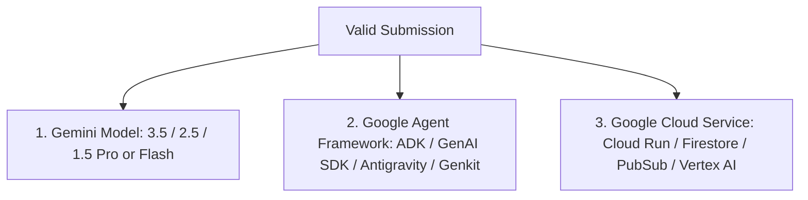

# 📋 01. Hackathon Debrief & Official Rules Breakdown

## 1. Overview
The **All Things Agentic Hackathon** is Google's premier global developer competition designed to push AI beyond static chat loops into **autonomous, stateful, and background agentic systems**.

- **Official Devpost URL:** [allthingsagentichackathon.devpost.com](https://allthingsagentichackathon.devpost.com/)
- **Resources Tab:** [allthingsagentichackathon.devpost.com/resources](https://allthingsagentichackathon.devpost.com/resources)
- **Official Rules Tab:** [allthingsagentichackathon.devpost.com/rules](https://allthingsagentichackathon.devpost.com/rules)

---

## 2. Key Dates & Schedule

| Event | Date & Time | Notes |
| :--- | :--- | :--- |
| **Hackathon Start** | August 3, 2026 @ 9:00 AM PT | Submissions open |
| **$150 Credit Request Form Closes** | **August 28, 2026 @ 12:00 PM PT** | **CRITICAL: Submit early, takes up to 72h** |
| **Final Submission Deadline** | **August 31, 2026 @ 5:00 PM PDT** | Hard cutoff — no extensions |
| **Judging Period** | Sept 1, 2026 – Oct 1, 2026 | Evaluated by expert panel from Google & Devpost |
| **Winners Announced** | October 8, 2026 @ 10:00 AM PT | Leaderboard & Showcase published |

---

## 3. Mandatory Tech Stack Requirements (Eligibility Gate)

Every entry across all tracks **MUST** satisfy three technical requirements to avoid disqualification:

1. **Model Layer:** Must use Gemini 3.5 or newer (or Gemini 2.5 / 1.5 Pro / Flash) through Google AI Studio API or Google Cloud Vertex AI.
2. **Framework Layer:** Must use an official Google agent framework:
   - **Google ADK (`adk-python` / `google/adk-python`)** *(Highly Recommended)*
   - **Google GenAI SDK (`google-genai` / `@google/genai`)**
   - **Google Antigravity SDK**
   - **Firebase Genkit**
3. **Cloud Infrastructure Layer:** Must use at least one Google Cloud service:
   - **Cloud Run / Cloud Run Functions** (Serverless backend & containerized agent host)
   - **Firestore / Cloud SQL / Cloud Spanner** (Agent state, persistent memory, session storage)
   - **Cloud Pub/Sub** (Asynchronous event-driven triggers & task queues)
   - **Cloud Storage** (Multimodal assets, documents, agent artifacts)
   - **Vertex AI Search / Vertex AI Agent Builder / Model Armor**

---

## 4. Judging Criteria (100% Total)

| Weight | Criteria | What Judges Actually Score |
| :---: | :--- | :--- |
| **40%** | **Innovation & Operational Utility** | • **Autonomous Value:** Does the agent remove real-world friction without constant human steering? • **Action over Chat:** Does it actually *execute* actions (APIs, tools, DB updates, file manipulation) rather than just generating conversational text? • **Problem Relevance:** Is it solving a meaningful, painful problem? |
| **30%** | **Architectural Discipline & Tech Stack** | • **Robust Engineering:** Are agents decoupled with clean separation of concerns? • **State & Memory:** How does the agent handle session recovery, short-term vs long-term memory, and context limits? • **Reliability & Security:** How are credentials handled, retries managed, and prompt injections or hallucinated tool calls safeguarded? |
| **30%** | **Demo & Production Readiness** | • **Live Working Demo:** A crisp video (≤ 3 minutes) showing real-time execution with real data. • **Architecture Diagram:** A clear, professional system diagram showing data flow and cloud services. • **Code Quality & Reproducibility:** A public GitHub repository with clear setup instructions, `.env.example`, and clean code. |

---

## 5. Submission Checklist Deliverables

When submitting on Devpost before August 31, 2026 @ 5:00 PM PDT, you must supply:
- [ ] **Track Category:** Selection of 1 primary category (Taskmaster, Collaborative Partner, or Enterprise Fleet).
- [ ] **Project Name & Tagline:** A catchy, descriptive title explaining the core value proposition.
- [ ] **Detailed Project Description (Markdown):**
  - Problem statement & Inspiration
  - What it does & How it works
  - How we built it (Gemini, ADK, Google Cloud components)
  - Challenges we overcame & Architectural highlights
  - What's next / Roadmap
- [ ] **Architecture Diagram:** High-resolution diagram embedded in the write-up.
- [ ] **Public GitHub Repository URL:** Clean repo with license, documentation, and source code.
- [ ] **Demo Video URL (YouTube / Vimeo / Loom):** Maximum 3 minutes, showing the working agent in action.
- [ ] **Live Hosted Demo URL (Optional but highly recommended):** Working Cloud Run URL.
