# 🎯 03. Track Analysis, Strategic Choices & Win-Rate Matrix

Choosing the right track is 50% of the battle. The hackathon features three distinct tracks with separate $20,000 category prizes, plus eligibility for the $50,000 Grand Prize.

---

## 1. Comprehensive Track Breakdown

```mermaid
graph TD
    subgraph Track 1: The Taskmaster
    T1[Autonomous End-to-End Execution] --> T1A[Event Watchers / Webhooks]
    T1A --> T1B[Decomposition & Planning]
    T1B --> T1C[Multi-Tool API Execution]
    T1C --> T1D[Zero Human Handholding]
    end

    subgraph Track 2: The Collaborative Partner
    T2[Adaptive Interactive Co-Pilot] --> T2A[Multi-Turn Proactive Dialogue]
    T2A --> T2B[RAG + Active Reflection]
    T2B --> T2C[Persistent Episodic Memory]
    T2C --> T2D[User Personalization Curve]
    end

    subgraph Track 3: The Fortified Enterprise Fleet
    T3[Zero-Trust Multi-Agent Network] --> T3A[Agent Registry & Discovery]
    T3A --> T3B[Model Armor Guardrails]
    T3B --> T3C[Cross-Department Orchestration]
    T3C --> T3D[Full Audit Observability]
    end
```

---

### Track 1: The Taskmaster
- **The Core Focus:** Autonomous, event-driven workflows that eliminate human toil. The agent listens for a trigger, plans the entire sequence of operations, calls external APIs, handles errors gracefully, and delivers the finished artifact.
- **Judge Expectation:** **Zero hand-holding.** A judge does NOT want to see a chat interface asking "Should I do this now?". They want to see: *Input event occurs ➔ Agent executes 6 tool calls across 3 systems ➔ Verified output produced.*
- **Winning Archetypes:**
  - Autonomous Security Vulnerability Triager & Patch Generator (Watches GitHub alerts ➔ clones code ➔ writes unit test ➔ fixes bug ➔ opens PR).
  - Autonomous SDE Referral & Outreach Agent (Scrapes job leads ➔ parses requirements ➔ selects custom resume ➔ generates tailored emails ➔ creates Gmail drafts).
  - Intelligent Cloud FinOps Autoscaler (Watches GCP billing/metrics ➔ detects anomalies ➔ safely provisions or adjusts instance limits).

---

### Track 2: The Collaborative Partner
- **The Core Focus:** Proactive, stateful guidance that gets smarter over time. The agent is a peer/mentor that asks insightful clarifying questions, remembers prior user feedback across sessions, uses Retrieval-Augmented Generation (RAG), and adapts its explanations.
- **Judge Expectation:** **Adaptive Memory & Proactive Inquiry.** The agent must demonstrate that it remembers what you said 3 sessions ago, challenges flawed assumptions, and reflects on user preferences.
- **Winning Archetypes:**
  - AI Code Architect & System Design Partner (Interviews you on system constraints ➔ produces C4 diagrams ➔ critiques architecture ➔ remembers team coding standards).
  - Autonomous Clinical / Legal Document Co-Pilot (Interactive cross-examination of complex contracts with citation grounding and persistent memory of client risk tolerance).
  - Interactive UI/UX Design Collaborator (Turns vague natural language into component code, adapting to user feedback and brand style guides).

---

### Track 3: The Fortified Enterprise Fleet
- **The Core Focus:** Multi-agent swarms with enterprise governance, zero-trust security, auditability, and discovery (leveraging Gemini Enterprise Agent Platform patterns).
- **Judge Expectation:** **Security, Scalability & Inter-Agent Coordination.** Show how 3+ specialized agents communicate via an Agent Gateway, discover each other in an Agent Registry, enforce Model Armor against prompt injections, and maintain an immutable audit trail.
- **Winning Archetypes:**
  - Enterprise Procurement & Supply Chain Swarm (Procurement Agent + Compliance Agent + Vendor Risk Agent communicating with Model Armor screening all supplier communications).
  - Healthcare Multi-Agent Clinical Trial Matcher (HIPAA-compliant Agent Mesh with PII redaction, FHIR database gateway, and verifiable reasoning chains).
  - Zero-Trust DevOps & Incident Response Swarm (SRE Agent + Database Agent + Security Auditor Agent executing automated runbooks with granular access tokens).

---

## 2. Strategic Comparison & Decision Matrix

| Dimension | Track 1: The Taskmaster | Track 2: The Collaborative Partner | Track 3: The Fortified Enterprise Fleet |
| :--- | :--- | :--- | :--- |
| **Primary Theme** | Autonomy & Action | Memory & Adaptability | Governance & Multi-Agent Swarms |
| **Technical Complexity** | Medium | Medium-High | High |
| **Demo "Wow" Factor** | High (seeing autonomous work done live) | High (seeing personalized memory & proactive UX) | Extremely High (swarm visualizer & security dashboard) |
| **Expected Competition Volume** | Highest (45% of entries) | Medium (35% of entries) | Lowest (20% of entries) |
| **Grand Prize Viability** | Very Strong (if utility is undeniable) | Strong | Highest (aligns directly with Google Enterprise Strategy) |

---

## 3. Recommended Winning Strategy Recommendation

### Option A: Track 1 (Taskmaster) — Fast, Crisp, Undeniable Utility
If you want to build a bulletproof working demo quickly with maximum reliability, pick **The Taskmaster**.
- **Recommended Build:** **AutoPR-Sentinel** or **JobStream-Autonomous** — an autonomous multi-stage pipeline using Google ADK + Gemini 2.5 Flash on Cloud Run with Firestore state tracking.

### Option B: Track 3 (Enterprise Fleet) — Maximum Prize Leverage
If you want to aim directly for the **$50,000 Grand Prize** and stand out from generic chatbot projects, pick **The Fortified Enterprise Fleet**.
- **Recommended Build:** **AgentMesh-Enterprise** — a 3-agent swarm (Coordinator + Tool Agent + Auditor Agent) incorporating Google Cloud Model Armor, Firestore Memory Bank, and Cloud Pub/Sub event orchestration.
