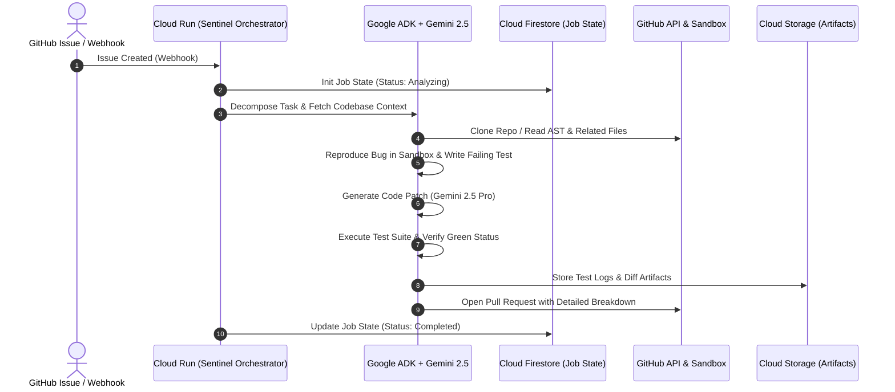
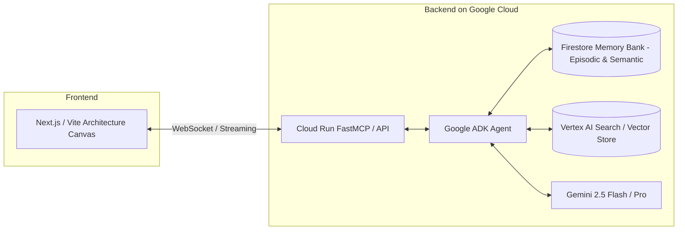
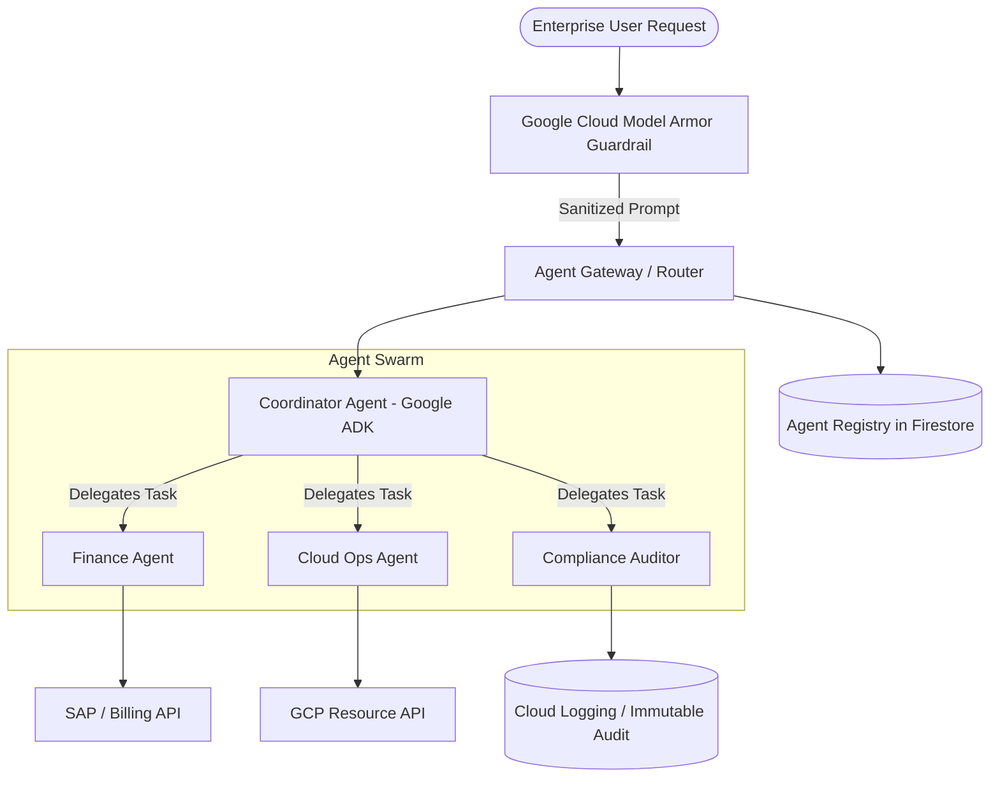

# 🏗️ 04. Winning Project Blueprints & Architectures

> **Research document — written 2026-08-21, before implementation.**
> This records planning and intent, not current behaviour. For what the system
> actually does see the [README](../README.md) and
> [the system design](specs/2026-08-22-live-system-design.md). Where they
> disagree, the code is authoritative.
>
> **Correction (verified 2026-08-22):** `gemini-2.5-*` returns **404 for new API
> keys**, and the Pro tier returns 429 on the free tier. Live routing is
> `gemini-3.1-flash-lite` (fast) and `gemini-3.6-flash` (reasoning), with a
> fallback chain across four models because each thinking-capable Flash model is
> capped at 20 requests/day.

Here are three complete, production-ready project blueprints tailored specifically to satisfy the mandatory Google Cloud stack and maximize scores across Innovation (40%), Architecture (30%), and Demo (30%).

---

## 🏆 Blueprint 1: "DevOps Sentinel" — Autonomous Issue-to-PR Engine
**Target Track:** **The Taskmaster** (Track 1)  
**Tagline:** *Zero-human intervention from bug report to verified pull request on Google Cloud.*

### 1. Problem & Innovation
Developers spend 30%+ of their day triaging bug tickets, reproducing issues, writing boilerplate unit tests, and verifying deployments. **DevOps Sentinel** acts as a headless, event-driven taskmaster agent that listens to GitHub/Jira webhooks, clones code, isolates failing tests, writes fixes using Gemini 2.5 Pro, runs verification builds on Cloud Run, and submits a reviewed PR.

### 2. Architecture & Data Flow

### 3. Google Stack Checklist
- **Gemini:** Gemini 2.5 Flash for code parsing + Gemini 2.5 Pro for patch synthesis.
- **Framework:** Google ADK (`adk-python`) with customized tool functions.
- **Google Cloud:** Cloud Run (Container host), Firestore (Task execution state & logs), Cloud Storage (Diff artifacts).

### 4. Why This Wins
- **100% Autonomous:** Removes 10+ manual developer steps without prompting for guidance.
- **Provable Utility:** Any software engineer or judge instantly recognizes the massive ROI.

---

## 🏆 Blueprint 2: "ArchTwin" — Adaptive System Architecture Partner
**Target Track:** **The Collaborative Partner** (Track 2)  
**Tagline:** *The proactive AI co-pilot that interviews you, learns your system constraints, and remembers your design philosophy across projects.*

### 1. Problem & Innovation
Standard LLM coding assistants forget everything after a session closes and give generic, ungrounded architecture advice. **ArchTwin** is an interactive architecture partner that conducts structured Socratic design interviews, actively challenges bottlenecks, generates live C4/Mermaid architecture diagrams, and uses persistent episodic memory in Firestore to adapt to your engineering standards.

### 2. Architecture & Data Flow

### 3. Key Agent Behaviors (What Judges See)
1. **Active Inquiry:** Instead of immediately answering a vague prompt ("Design a payment system"), ArchTwin asks: *"What is your expected QPS, consistency requirement (ACID vs Eventual), and cloud budget?"*
2. **Persistent Reflection:** When you start a new session 3 days later, it says: *"Welcome back, Shaan. Based on our Kafka latency discussion on Tuesday, I have updated your caching topology."*
3. **Live Diagramming:** Streams valid Mermaid.js diagrams directly to the UI canvas.

---

## 🏆 Blueprint 3: "ZeroTrust-Swarm" — Enterprise Agent Governance Mesh
**Target Track:** **The Fortified Enterprise Fleet** (Track 3)  
**Tagline:** *Zero-trust multi-agent orchestration with Google Cloud Model Armor and real-time auditability.*

### 1. Problem & Innovation
Enterprises cannot deploy autonomous agents without strict security guarantees against prompt injection, data exfiltration, and untrusted tool invocation. **ZeroTrust-Swarm** implements the Gemini Enterprise Agent Platform pattern: a central Coordinator Agent discovers specialized worker agents (HR, Finance, Cloud Ops) in an **Agent Registry**, passes all user inputs through **Google Cloud Model Armor**, and routes tasks using granular JWT-based **Agent Identity**.

### 2. Architecture & Data Flow

### 3. Security Highlights
- **Model Armor Inspection:** Real-time pre-execution scanning against jailbreaks and PII leaks.
- **Zero-Trust Identity:** Each sub-agent authenticates with its own short-lived service credential.
- **Audit Dashboard:** Web interface showing full step-by-step reasoning chains with latency and cost metrics.

### 4. Why This Wins
- Directly implements Google's high-priority enterprise strategy (GEAP / Model Armor / ADK).
- Lowest competition density on Devpost with the highest evaluation scores for architectural discipline (30%) and enterprise relevance.
