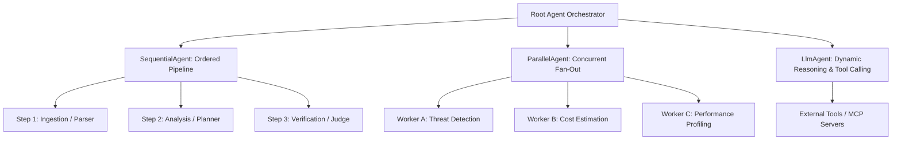
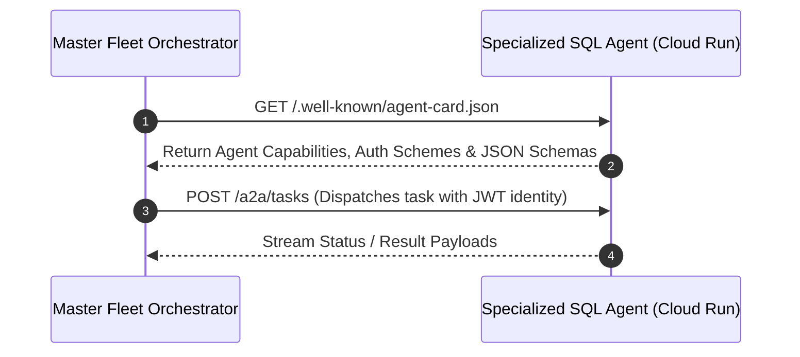
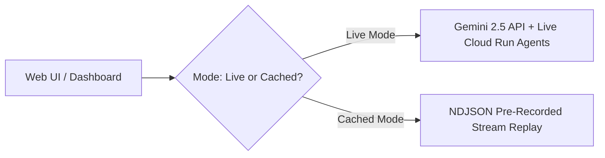

# 🧠 07. Advanced Agentic Patterns: Google ADK, A2A Protocol & MCP

> **Research document — written 2026-08-21, before implementation.**
> This records planning and intent, not current behaviour. For what the system
> actually does see the [README](../README.md) and
> [the system design](specs/2026-08-22-live-system-design.md). Where they
> disagree, the code is authoritative.


To win the hackathon, your architecture must move beyond basic single-prompt chains to **interoperable, observable, multi-agent systems**. This document covers the core standards Google pioneered at Google Cloud Next: **Google ADK**, the **Agent-to-Agent (A2A) Protocol**, and the **Model Context Protocol (MCP)**.

---

## 1. Google Agent Development Kit (ADK) Core Taxonomy

Google ADK (`google-adk` / `github.com/google/adk-python`) classifies agent architectures into discrete execution primitives:



### The 4 Core Agent Types in ADK

| Agent Class | Purpose | Best Use Case |
| :--- | :--- | :--- |
| **`LlmAgent`** | LLM-driven reasoning, autonomous planning, and tool execution. | Dynamic problem solving, conversational co-pilots, multi-tool investigation. |
| **`SequentialAgent`** | Deterministic pipeline that passes output of Agent $N$ as input to Agent $N+1$. | Staged workflows (Ingest ➔ Clean ➔ Analyze ➔ Report ➔ Deploy). |
| **`ParallelAgent`** | Concurrently runs multiple independent agents and aggregates their outputs. | Multi-perspective code review, parallel web search, multi-cloud pricing comparison. |
| **`BaseAgent`** | Custom Python class implementing the lifecycle `run()` methods. | Low-level orchestration, custom rate-limiters, deterministic fallback engines. |

---

## 2. The Agent-to-Agent (A2A) Protocol & `agent-card.json`

Google donated the **A2A Protocol** to open-source to solve the "Agent Silo" problem. Instead of hardcoded API contracts, agents publish an **Agent Card** at `/.well-known/agent-card.json`.



### Production `agent-card.json` Specification

```json
{
  "name": "CloudSQLDiagnosticAgent",
  "description": "Autonomous Google Cloud SQL diagnostic and index optimization agent.",
  "version": "1.2.0",
  "provider": {
    "name": "Shaan-Enterprise-Fleet",
    "url": "https://agent-mesh.run.app"
  },
  "endpoints": {
    "http": "https://sql-agent-xyz.a.run.app/a2a/v1/invoke",
    "streaming": "wss://sql-agent-xyz.a.run.app/a2a/v1/stream"
  },
  "security": {
    "auth_type": "bearer_token",
    "token_issuer": "https://accounts.google.com"
  },
  "skills": [
    {
      "name": "analyze_query_latency",
      "description": "Parses Cloud SQL slow query logs and suggests B-Tree/GIN indexes.",
      "input_schema": {
        "type": "object",
        "properties": {
          "instance_id": {"type": "string"},
          "time_window_minutes": {"type": "integer"}
        },
        "required": ["instance_id"]
      }
    }
  ]
}
```

---

## 3. Model Context Protocol (MCP) + Google ADK Integration

By combining **ADK (Cognitive Brain)** with **MCP (Standardized Tool Interface)**, an agent can instantly connect to dozens of tools without custom wrappers:

```python
# Integrating an MCP Server inside a Google ADK / Gemini Agent Loop
import asyncio
from google import genai
from google.genai import types

class McpToolBridge:
    def __init__(self, mcp_server_url: str):
        self.server_url = mcp_server_url

    async def list_available_tools(self) -> list:
        """Fetches dynamic tool schemas from MCP server over SSE / stdio."""
        # Simulated discovery from MCP server
        return [
            {
                "name": "query_cloud_spanner",
                "description": "Executes read-only SQL queries on Google Cloud Spanner.",
                "parameters": {
                    "type": "OBJECT",
                    "properties": {
                        "query": {"type": "STRING", "description": "SQL statement"}
                    },
                    "required": ["query"]
                }
            }
        ]

    async def execute_tool(self, name: str, args: dict) -> dict:
        """Dispatches tool execution to the MCP server."""
        print(f"[*] Dispatching MCP tool: {name} with args {args}")
        return {"status": "SUCCESS", "rows_returned": 142, "latency_ms": 12.4}
```

---

## 4. The "Cached vs Live Replay" Pattern (Keynote Hack)

As revealed in Google's `GoogleCloudPlatform/race-condition` architecture, hackathon judges and stage presenters must protect against network glitches and rate-limit errors:



### Why this is a Secret Weapon:
1. **Zero Cold-Start Lag in Video Demos:** You can capture your video flawlessly without waiting 15 seconds for a slow API call.
2. **Instant Judge Testing:** If a judge runs your frontend without configuring an API key, it seamlessly falls back to a realistic cached demonstration stream rather than crashing with an ugly `500 Internal Server Error`.
