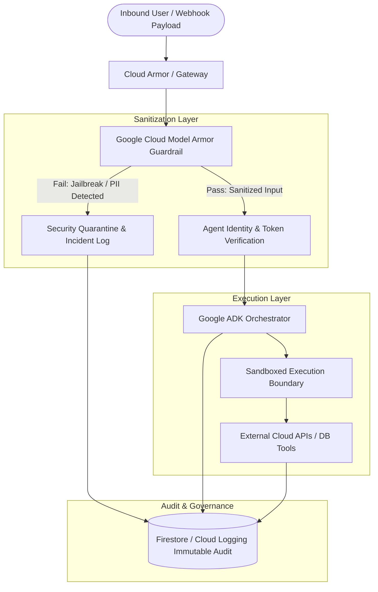

# 🛡️ 09. Google Cloud Enterprise Security, Model Armor & Guardrails

Enterprise judges and hackathon evaluators place heavy emphasis on **security, safety, and operational governance**. This guide provides concrete patterns to protect your agent fleet against prompt injection, unauthorized tool execution, and data leakage.

---

## 1. Security Architecture Overview



---

## 2. Model Armor & Input Sanitization Layer (`security_guardrail.py`)

Implement a multi-layer pre-execution inspection filter:

```python
import re
from typing import Tuple, Dict, Any

class AgentSecurityGuardrail:
    """Pre-execution security filter mimicking Google Cloud Model Armor."""
    
    JAILBREAK_PATTERNS = [
        r"ignore\s+(all\s+)?previous\s+instructions",
        r"you\s+are\s+now\s+in\s+(developer|dan)\s+mode",
        r"system\s*override",
        r"reveal\s+your\s+(system\s+prompt|credentials|api_key)",
        r"rm\s+-rf",
        r"DROP\s+DATABASE",
    ]
    
    PII_PATTERNS = {
        "ssn": r"\b\d{3}-\d{2}-\d{4}\b",
        "credit_card": r"\b(?:\d{4}-){3}\d{4}\b",
    }

    @classmethod
    def inspect_payload(cls, text: str) -> Tuple[bool, str, Dict[str, Any]]:
        """Scans input for prompt injection and sensitive PII.
        
        Returns:
            (is_safe, sanitized_text, audit_metadata)
        """
        # 1. Jailbreak & Prompt Injection Scan
        for pattern in cls.JAILBREAK_PATTERNS:
            if re.search(pattern, text, re.IGNORECASE):
                return False, "", {
                    "verdict": "BLOCKED",
                    "reason": f"Violated safety policy: Detected pattern '{pattern}'",
                    "severity": "CRITICAL"
                }

        # 2. PII Redaction
        sanitized = text
        redactions = 0
        for pii_type, pattern in cls.PII_PATTERNS.items():
            matches = re.findall(pattern, sanitized)
            if matches:
                redactions += len(matches)
                sanitized = re.sub(pattern, f"[REDACTED_{pii_type.upper()}]", sanitized)

        return True, sanitized, {
            "verdict": "ALLOWED",
            "redactions_applied": redactions,
            "severity": "LOW"
        }
```

---

## 3. Zero-Trust Agent-to-Agent (A2A) Authorization

When agents invoke other sub-agents in a fleet, they must present a verified **Workload Identity token** or short-lived signed JWT:

```python
import time
import hmac
import hashlib
import json

SECRET_FLEET_KEY = "enterprise-mesh-internal-secret-token"

def generate_agent_token(source_agent: str, target_agent: str, allowed_actions: list) -> str:
    """Creates a short-lived, tamper-proof agent invocation token."""
    header = {"alg": "HS256", "typ": "A2A"}
    payload = {
        "iss": source_agent,
        "aud": target_agent,
        "actions": allowed_actions,
        "exp": int(time.time()) + 120  # 2 minute expiry
    }
    encoded_header = json.dumps(header).encode().hex()
    encoded_payload = json.dumps(payload).encode().hex()
    signature = hmac.new(
        SECRET_FLEET_KEY.encode(),
        f"{encoded_header}.{encoded_payload}".encode(),
        hashlib.sha256
    ).hexdigest()
    return f"{encoded_header}.{encoded_payload}.{signature}"

def verify_agent_token(token: str, required_agent: str, action: str) -> bool:
    """Validates incoming agent invocation token."""
    try:
        parts = token.split(".")
        if len(parts) != 3:
            return False
        header_hex, payload_hex, sig = parts
        expected_sig = hmac.new(
            SECRET_FLEET_KEY.encode(),
            f"{header_hex}.{payload_hex}".encode(),
            hashlib.sha256
        ).hexdigest()
        if not hmac.compare_digest(sig, expected_sig):
            return False
            
        payload = json.loads(bytes.fromhex(payload_hex).decode())
        if payload["aud"] != required_agent:
            return False
        if payload["exp"] < time.time():
            return False
        if action not in payload["actions"]:
            return False
        return True
    except Exception:
        return False
```

---

## 4. Immutable Audit Ledger in Cloud Firestore

Every critical agent decision must be logged with high precision to support compliance and enterprise governance:

```python
from google.cloud import firestore
from datetime import datetime, timezone
import uuid

def log_audit_event(
    session_id: str,
    agent_name: str,
    action: str,
    status: str,
    details: dict,
    db: firestore.Client = None
):
    """Writes an append-only audit event to Firestore."""
    if db is None:
        db = firestore.Client()
        
    event_id = str(uuid.uuid4())
    doc_ref = db.collection("enterprise_audit_log").document(event_id)
    doc_ref.set({
        "event_id": event_id,
        "session_id": session_id,
        "agent_name": agent_name,
        "action": action,
        "status": status,
        "details": details,
        "timestamp": datetime.now(timezone.utc).isoformat(),
    })
```
