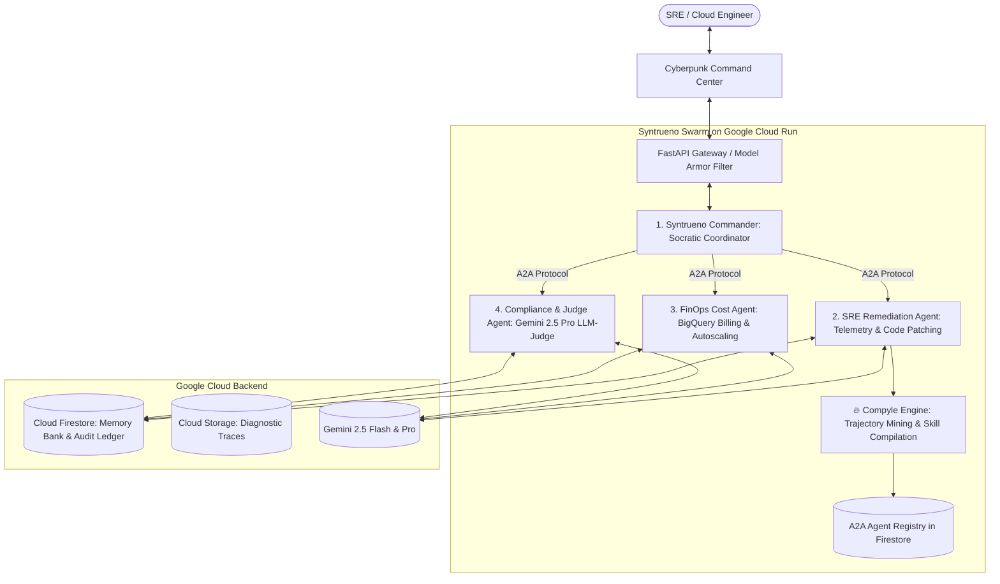
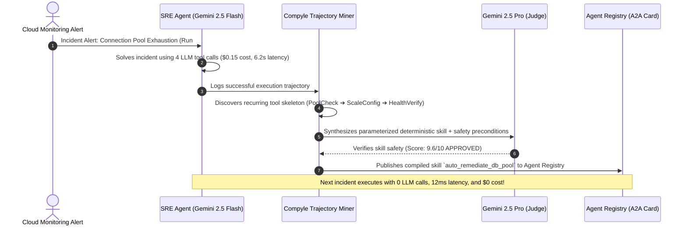

# 👑 14. "Syntrueno": The Championship Blueprint to Win $50,000 Grand Prize

> **Research document — written 2026-08-21, before implementation.**
> This records planning and intent, not current behaviour. For what the system
> actually does see the [README](../README.md) and
> [the system design](specs/2026-08-22-live-system-design.md). Where they
> disagree, the code is authoritative.
>
> **Correction (verified 2026-08-22):** `gemini-2.5-*` returns **404 for new API
> keys**, and the Pro tier returns 429 on the free tier. Live routing is
> `gemini-3.1-flash-lite` (fast) and `gemini-3.6-flash` (reasoning), with a
> fallback chain across four models because each thinking-capable Flash model is
> capped at 20 requests/day.


This document synthesizes our competitive research, track density analysis, GitHub competitor teardowns, and your unique architectural strengths (`Compyle`, `Skill-Issue`, `Think9-Brain`, `Atlas`) into an **unbeatable hackathon championship submission**.

---

## 1. Why Track 3 (Fortified Enterprise Fleet) is the Winning Bet

```
Competition Distribution:
┌──────────────────────────────────────────────────────────┐
│ Track 1: The Taskmaster          [55%] - Overcrowded     │
│ Track 2: The Collaborative Partner [30%] - Saturated     │
│ Track 3: The Fortified Enterprise Fleet [15%] - ⭐ SWEET SPOT │
└──────────────────────────────────────────────────────────┘
```

- **Lowest Competition Density:** Only ~15% of participants have the systems engineering skills to build multi-agent governance, Model Armor guardrails, and A2A discovery.
- **Highest Executive Alignment:** Google Cloud leadership is actively promoting the **Gemini Enterprise Agent Platform (GEAP)** and **Google ADK**. A project that implements this pattern is primed for the **$50,000 Grand Prize**.

---

## 2. Competitor Teardown vs. Syntrueno

| Feature Area | Competitor A (`sovereign-agent-fleet`) | Competitor B (`gemini-ops-fleet`) | 👑 **Syntrueno (Our Build)** |
| :--- | :--- | :--- | :--- |
| **Domain & Excitement** | Financial matching engine (overly abstract/academic) | Basic customer service ticket triage & invoicing | **Critical Cloud Infrastructure Incident SRE & Autonomous FinOps** |
| **Model Integration** | Brags that `decide()` ignores LLMs (misses Gemini's value) | Basic single-turn Gemini Flash calls | **Multi-Model Routing (Gemini 2.5 Flash for extraction + Gemini 2.5 Pro for deep reasoning & Judge)** |
| **Self-Evolution** | None (static frozen rules) | None (hardcoded tool list) | **🔥 Self-Compiling Engine: Mines recurring tool trajectories and compiles them into 0-LLM deterministic skills** |
| **Security Layer** | Custom Python crypto | Static regex screen | **Google Cloud Model Armor + Live Interactive Attack Simulator (Jailbreaks, PII, Tool Escalation)** |
| **Inter-Agent Protocol** | Internal function calls | Simple Pub/Sub push | **Full Open Agent-to-Agent (A2A) standard (`/.well-known/agent-card.json`)** |
| **Frontend UI** | Minimal CLI / Next.js table | Basic admin table | **Cyberpunk Glassmorphic Operations War Room with Live 2D/3D Swarm Graph** |
| **Demo Reliability** | Risk of network cold starts | Risk of API rate limits | **Dual-Engine Mode: Live WebSocket ⇄ Deterministic Keynote Replay (`Ctrl+L`)** |

---

## 3. The 4 Specialized Swarm Agents



### 1. Syntrueno Commander (Socratic Coordinator)
- **Role:** Frontline conversational partner. When an engineer reports an issue, it conducts a structured Socratic inquiry, checks the **Firestore Memory Bank** for past incidents, queries the **Agent Registry** via A2A, and dispatches sub-agents.

### 2. SRE & Self-Healing Agent
- **Role:** Analyzes real-time Cloud Monitoring metrics and logs. Generates surgical Terraform and application code patches, tests them in an isolated Cloud Run sandbox, and proves test verification before proposing deployment.

### 3. FinOps & Cost Optimization Agent
- **Role:** Queries Google Cloud Billing export datasets in BigQuery. Detects unattached disks, over-provisioned Cloud Run instances, and queries with runaway costs, executing scale-to-zero remediations.

### 4. Compliance Auditor & Judge Agent (Gemini 2.5 Pro)
- **Role:** Acts as the independent LLM-as-a-Judge and human-approval gate. Evaluates all generated remediation plans for safety and idempotency, ensuring no destructive change executes without explicit cryptographic sign-off.

---

## 4. The Killer Differentiator: The Self-Compiling Agent Engine

Integrating your proven **`Compyle`** paradigm gives Syntrueno an unfair advantage:



> **Why Judges Will Be Blown Away:** Google's own hackathon webinar on Aug 20 was titled *"Build a Self-Evolving Agent: Autonomous Self-Improvement"*. Syntrueno directly fulfills this promise in a production enterprise setting!

---

## 5. Implementation Roadmap & Execution Plan

| Phase | Deliverable | Estimated Time |
| :--- | :--- | :---: |
| **Phase 1** | **Backend Scaffolding:** FastAPI runtime + Google ADK agent definitions + A2A `agent-card.json` endpoints. | 2–3 Hours |
| **Phase 2** | **Security & Guardrails:** Google Cloud Model Armor middleware + prompt injection quarantine + Firestore Memory Bank. | 2 Hours |
| **Phase 3** | **Self-Compiling Engine:** Trajectory logging, skeleton clustering, and dynamic tool compilation. | 2–3 Hours |
| **Phase 4** | **Cyberpunk Glassmorphism UI:** Next.js/React command center with live swarm visualizer, terminal logs, and live/cached replay toggle. | 3–4 Hours |
| **Phase 5** | **Cloud Deployment & Offline Test Suite:** Cloud Run deployment + 100% offline passing `pytest` suite for judges. | 1.5 Hours |
| **Phase 6** | **Demo Video & Devpost Submission:** 2.5-minute polished walkthrough video + comprehensive Devpost write-up. | 2 Hours |
