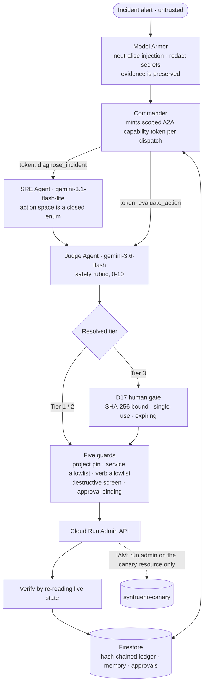

# Syntrueno — Devpost Submission Package

**Google Cloud "All Things Agentic" Hackathon 2026**
**Track:** The Fortified Enterprise Fleet

> Every figure in this document is measured against the live deployment. Where a
> number appears, it came from `perf_counter` or the model's own `usage_metadata`.

---

## 1. Devpost fields

### Project title
`Syntrueno — Zero-Trust Autonomous Cloud Operations Swarm`

### Tagline (under 200 characters)
`Gemini agents that diagnose live outages, judge their own plans for safety, and execute verified fixes on real Google Cloud infrastructure behind a single-use cryptographic human gate.`

### Track
`Track 3: The Fortified Enterprise Fleet`

### Links
- **Live:** https://syntrueno-18489510475.us-central1.run.app
- **Agent card:** https://syntrueno-18489510475.us-central1.run.app/.well-known/agent-card.json
- **Repository:** https://github.com/Shaan-alpha/syntrueno

---

## 2. Project story

### Inspiration

Two things stop enterprises deploying autonomous agents against production
infrastructure, and neither is model quality.

The first is that an agent which can fix things can also break things. A CISO
does not want a probabilistic system holding a credential that can delete a
database, no matter how good the prompt is.

The second is subtler and, we think, more interesting: **agents that report
their own success are unfalsifiable.** An agent that says "remediation applied"
because an API returned 200 has told you nothing about whether the incident is
actually over.

Syntrueno is built around both problems. It can change real infrastructure, but
the surface it can reach is deliberately tiny — and it proves its own work by
re-reading live state rather than trusting an acknowledgement.

### What it does

An alert arrives carrying whatever the world put in it, including hostile text.

**Model Armor** screens it. Crucially, inbound evidence and outbound actions get
*different* rule sets. Real incident telemetry quotes SQL and shell commands —
that is what an outage looks like — so screening evidence for `DROP TABLE` and
refusing the alert would break the product's primary use case. Injection attempts
are neutralised in place; the surrounding evidence survives.

**The Commander** mints a scoped, short-lived A2A capability token for each
dispatch. A token issued for diagnosis cannot be replayed to obtain a safety
evaluation.

**The SRE agent** diagnoses from telemetry using Gemini. Its action space is a
closed enum handed to the model as a response schema — so a successful prompt
injection cannot produce a destructive tool call, because no destructive verb is
representable. The worst achievable outcome is a *wrong safe action*.

**The Judge** scores the plan 0–10 against a safety rubric using a
thinking-enabled model. It is genuinely adversarial: given a plausible-looking
connection-pool fix, it returned **3.5 and rejected it**, observing that raising
a client pool ceiling across autoscaling Cloud Run instances can exceed the
database's own `max_connections`, and that a p99 of 4,200 ms indicates slow
queries the change would only mask.

**The D17 gate** requires a human signature bound by SHA-256 to one tool, one
parameter set, one tier. The signature is spent on execution and expires.

**Cloud Run Admin** applies the change through five guards, then **verifies by
re-reading live state**.

**Firestore** records a hash-chained audit entry and the memory the next
incident will read.

### How we built it

- **Models:** `gemini-3.1-flash-lite` for diagnosis, `gemini-3.6-flash` for
  judgement, via the `google-genai` SDK with Pydantic structured output.
- **Backend:** FastAPI on Cloud Run, scale-to-zero.
- **State:** Firestore — audit ledger, cross-session memory, approvals, trajectories.
- **Secrets:** Secret Manager, mounted at runtime.
- **Frontend:** React 19 + TypeScript operations console served from the same container.

### Challenges we overcame

**The model line moved under us.** `gemini-2.5-*` returns 404 for new API keys.
We found this by calling it, not by reading about it, and re-verified every model
claim by execution.

**Per-model daily caps.** The free tier allows 20 requests per day on each
thinking-capable Flash model. Two model calls per incident means ten incidents a
day — not enough to develop against, let alone record a demo. A 429 there is a
*daily* cap that backoff will never clear, so the client advances through an
ordered model chain instead of retrying, pooling roughly 560 reasoning calls a
day out of four models.

**A replay hole we found by executing for real.** An approval signed earlier
still authorised the identical action later, because only the action hash was
compared. Sign a memory bump once and the swarm could repeat it unprompted.
Approvals became single-use and expiring. Then production surfaced a second
variant: runs that failed *after* signing left valid unspent signatures behind,
and a replay quietly satisfied itself from that pool. Authorisation is now bound
to the specific approval being executed. Neither bug was reachable from local
testing with mocks.

**Waiting on the operation cost more than it was worth.** Awaiting the Cloud Run
long-running operation requires `run.operations.get`, a project-level permission.
Granting it would widen the service account past the single canary resource it is
scoped to, purely to watch an operation we do not need. Polling live state is
narrower *and* a stronger signal: the operation succeeding only means Cloud Run
accepted the request.

### Accomplishments we're proud of

- **The agent cannot express a destructive action.** Not filtered — unrepresentable.
- **The Judge catches genuinely bad plans**, including one our own earlier
  heuristic had rubber-stamped at 9.4/10.
- **Every number the system reports is measured.** No latency floors, no
  hardcoded token counts.
- **The system reports its own degradation** instead of presenting a fallback as
  a result.
- **113 tests pass offline in ~0.9s** with no API key and no cloud credentials.
  A guard test fails if writes get slow enough to imply a network round trip.

### What we learned

Building an agent that acts on real infrastructure teaches you something mocks
cannot: **both of our authorisation bugs were invisible until a real mutation
ran against a real service.** The guards looked correct in tests and were
correct in isolation. What was wrong was an assumption about how signatures
accumulate over time — and only production made that visible.

### What's next

- Cloud Monitoring alert → Pub/Sub → webhook for fully event-driven triage
- `modelarmor.googleapis.com` in front of the regex layer as defence in depth
- ThorForja compiling genuinely recurring trajectories into dispatchable skills
- Multimodal telemetry ingestion and BigQuery-backed FinOps

---

## 3. Architecture

---

## 4. Three-minute video script

| Time | On screen | Narration |
| :-- | :-- | :-- |
| **0:00–0:20** | Console, dark mode. Status pill reads *Cloud Run · Gemini Live*. | "Enterprises won't let agents touch production, for two reasons. An agent that can fix things can break things. And an agent that reports its own success is unfalsifiable. Syntrueno is built around both." |
| **0:20–0:50** | Security tab. Paste an injection. Then paste an alert quoting `DROP TABLE`. | "Watch the distinction most systems miss. This injection is quarantined. But *this* is a real alert that happens to quote SQL — and it passes, because evidence is not instruction. Screening evidence for dangerous words breaks the product." |
| **0:50–1:40** | Trigger the incident. Live feed, real latencies. | "A real alert, with an injection buried in the error text. The injection is neutralised, the evidence survives. Gemini diagnoses the OOM at full confidence and picks a tool — from a closed enum with no destructive verb in it. The injection could not have produced one." |
| **1:40–2:10** | Judge verdict and critique. | "Now the Judge. It scores 8 out of 10 and routes to a human gate. Earlier it scored a different plan 3.5 and rejected it, catching that the fix would exceed the database's own connection ceiling. That's a plan our first heuristic approved at 9.4." |
| **2:10–2:40** | Sign the gate. Cloud Console beside it: 512Mi → 1Gi. Then replay. | "I sign. One signature, bound to this exact change. The mutation runs — and Syntrueno proves it by re-reading live state, not by trusting a 200. Replay the same signature: refused. It's spent." |
| **2:40–3:00** | Audit ledger, chain valid. | "Hash-chained, in Firestore, surviving scale-to-zero. Every number you saw was measured. Nothing was scripted. That's Syntrueno." |

---

## 5. Cost

Runs inside Google Cloud's always-free tier.

| Component | Free allowance | Usage |
| :-- | :-- | --: |
| Cloud Run | 2M requests/month, scale-to-zero | $0.00 |
| Firestore | 1 GiB, 50k reads / 20k writes daily | $0.00 |
| Gemini API | free tier, ~560 reasoning calls/day via model chain | $0.00 |
| Secret Manager | 6 active secret versions | $0.00 |
| Artifact Registry | 0.5 GB | $0.00 |

Both Cloud Run services run `--min-instances 0`.

---

## 6. Pre-submission checklist

- [x] Repository public with an Apache-2.0 license
- [x] `.env.example` with no real secrets
- [x] Offline test suite green with no credentials
- [x] Live Cloud Run deployment
- [x] Spec-documented architecture
- [ ] Architecture diagram exported to PNG for Devpost
- [ ] Demo video under 3 minutes
- [ ] Devpost form submitted

> **Internal note:** `docs/12_COMPETITIVE_LANDSCAPE_AND_GAP_ANALYSIS.md` names
> real competitor repositories and critiques them. It is working research and
> must not appear in any public submission material.
